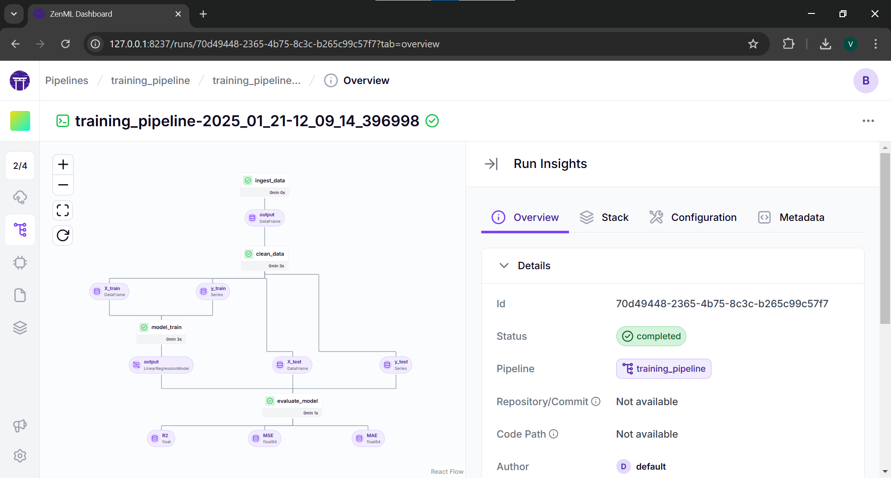
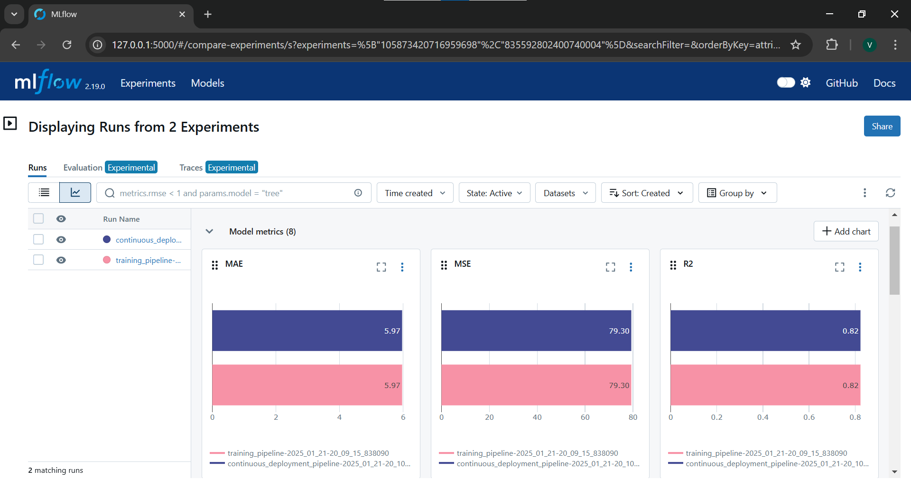

# Food Delivery Time Prediction 🛵

[](https://pypi.org/project/zenml/)

## 📘 Overview

This project focuses on predicting food delivery times using data, which includes various factors like distance, weather, traffic, and more. This challenge is perfect for machine learning practitioners interested in logistics, operations research, and predictive modeling.

---

## 📂 Dataset Description

The dataset contains key variables influencing delivery time, making it a robust foundation for developing predictive models.

### **Key Features**

- **`Order_ID`**: Unique identifier for each order.
- **`Distance_km`**: Delivery distance in kilometers.
- **`Weather`**: Weather conditions during delivery (e.g., Clear, Rainy, Snowy, Foggy, Windy).
- **`Traffic_Level`**: Traffic conditions categorized as **Low**, **Medium**, or **High**.
- **`Time_of_Day`**: Delivery time categorized as **Morning**, **Afternoon**, **Evening**, or **Night**.
- **`Vehicle_Type`**: Type of vehicle used for delivery (e.g., Bike, Scooter, Car).
- **`Preparation_Time_min`**: Time required to prepare the order (in minutes).
- **`Courier_Experience_yrs`**: Courier's experience in years.
- **`Delivery_Time_min`**: Total delivery time (in minutes). This is the **target variable** for prediction.

---

### 📥 Dataset Access

The dataset for this project is available on Kaggle. You can access it using the following link: [Food Delivery Time Prediction Dataset](https://www.kaggle.com/datasets/denkuznetz/food-delivery-time-prediction).

---

## ⚙️ MLOps Workflow

This project is structured as an **MLOps project**, aiming to productionize the predictive model. Prior to deployment, **Exploratory Data Analysis (EDA)** will be performed in a Jupyter Notebook to understand data distributions, detect anomalies, and identify relationships among features.

We are building an end-to-end pipeline for continuously predicting and deploying the machine learning model, alongside a data application that utilizes the latest deployed model for business consumption. 

The pipeline can be deployed to the cloud, scale according to our needs, and ensure tracking of parameters and data through every pipeline run. It includes raw data input, features, results, the machine learning model and parameters, and prediction outputs. ZenML simplifies building such a pipeline effectively.

---

## 📔 Notebooks for EDA and Modeling

- **Kaggle Notebook**: [Delivery Time Estimation - EDA & Modeling](https://www.kaggle.com/code/vbhanu5ai/delivery-time-estimation-eda-modeling)

- **Google Colab Notebook**: [EDA & Modeling Notebook](https://colab.research.google.com/drive/1y4CmaC0UA32f9tC9lWU_i699RxPrhF-K?usp=sharing)

---

## 📊 Results and Model Evaluation

Below are the evaluation metrics for different models tested during this project:

| Model                   | R² Score     | MSE           | RMSE         | MAE          |
| ----------------------- | ------------ | ------------- | ------------ | ------------ |
| XGBoost Regressor       | 0.776914     | 99.992949     | 9.999647     | 7.174253     |
| Random Forest Regressor | 0.762473     | 106.465966    | 10.318235    | 7.142900     |
| Linear Regression       | **0.826189** | **77.906575** | **8.826470** | **5.899169** |

### Best Model

**Linear Regression** was selected as the best-performing model due to its highest R² Score and the lowest RMSE and MAE values.
---
## 💻 System Requirements
- Linux or macOS.
## 🐍 Python Requirements

### Install Dependencies

1. Clone the project repository and navigate to the project directory:

   ```bash
   git clone https://github.com/zenml-io/zenml-projects.git
   cd zenml-projects
   ```

2. Install the required packages:

   ```bash
   pip install -r requirements.txt
   ```

### Set Up ZenML

1. Install optional dependencies for the ZenML server:

   ```bash
   pip install zenml["server"]
   zenml init
   zenml login --local --blocking
   ```

2. Install necessary integrations:

   ```bash
   zenml integration install mlflow -y
   ```

3. Configure a ZenML stack with MLflow experiment tracker and model deployer:

   ```bash
   zenml experiment-tracker register mlflow_tracker --flavor=mlflow
   zenml model-deployer register mlflow --flavor=mlflow
   zenml stack register mlflow_stack -a default -o default -d mlflow -e mlflow_tracker --set
   ```


## 📜 Pipelines Overview

### Training Pipeline

Our training pipeline consists of the following steps:

1. **`ingest_data`**: Ingests the data and creates a `DataFrame`.
2. **`clean_data`**: Cleans the data and removes unwanted columns.
3. **`train_model`**: Trains the model and logs it using MLflow autologging.
4. **`evaluation`**: Evaluates the model and saves metrics using MLflow autologging.

---
## Running Training Pipeline

Run the **training pipeline**:
```bash
python run_pipeline.py
```

Run **zenml server** to view pipeline DAG
```bash
zenml login --local --blocking
```

_In the sidebar open pipelines and click on training_pipeline, in that click the recent one_


_Training Pipeline_
### Deployment Pipeline

The deployment pipeline extends the training pipeline with additional steps:

1. **`deployment_trigger`**: Checks if the trained model meets deployment criteria (R2 Score threshold).
2. **`model_deployer`**: Deploys the model as a service using MLflow if the criteria are met.

Run the **training pipeline**:
```bash
python run_pipeline.py
```

_You can also pass aditional arguments like --config deploy or --config predict_

Run **zenml server** to view pipeline DAG
```bash
zenml login --local --blocking
```


_Continuous Deployment DAG_


_Inference Pipeline DAG_

ZenML's MLflow integration logs hyperparameters, trained models, and evaluation metrics into the MLflow backend. The pipeline launches a local MLflow deployment server to serve the latest model if it meets the accuracy threshold.


_MLFlow log data_
## Demo Streamlit App

To run the Streamlit app locally:

```bash
streamlit run streamlit_app.py
```


_streamlit UI_