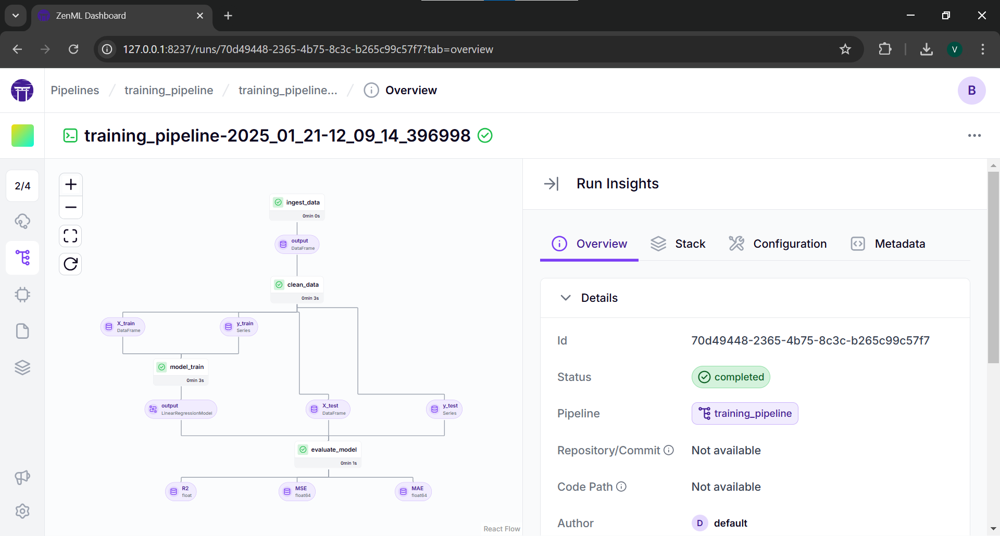
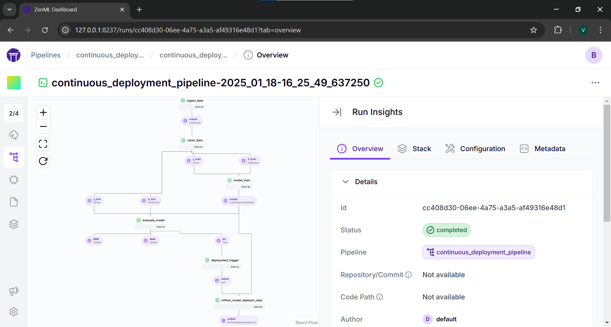
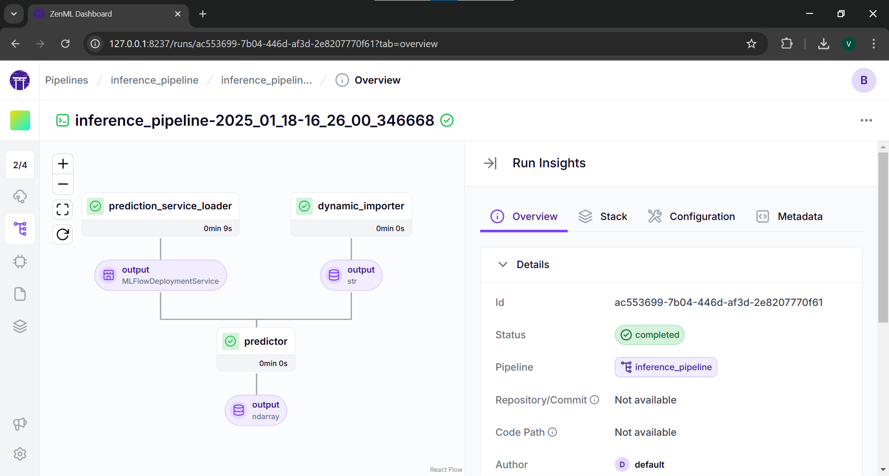
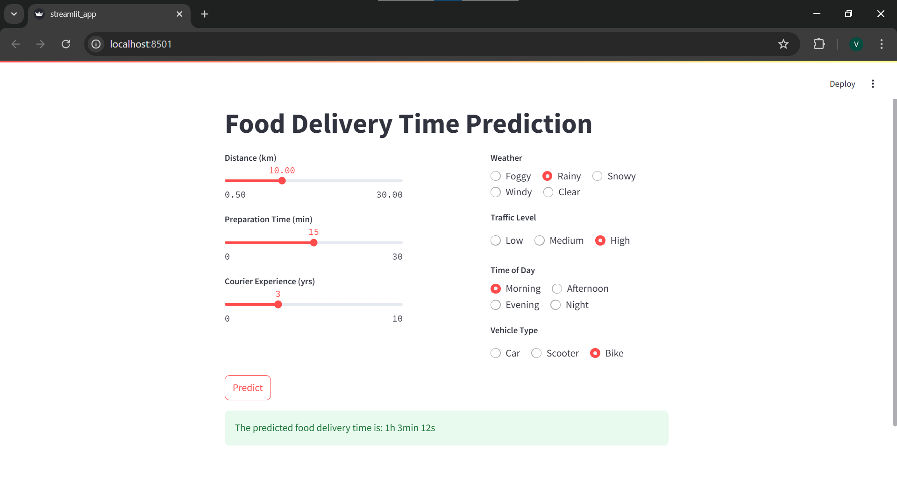

# End-to-End MLOps System for Food Delivery Time Prediction
[](https://pypi.org/project/zenml/)

## Overview

This project focuses on predicting food delivery times using data that includes various factors such as distance, weather, traffic, and more. This challenge is perfect for machine learning practitioners interested in logistics, operations research, and predictive modeling.

This project is structured as an **MLOps project**, aiming to productionize the predictive model.

## Tech Stack

- ### Tools and Frameworks
    [](https://www.zenml.io/)
    [](https://mlflow.org/)
    [](https://streamlit.io/)

- ### Libraries
    [](https://scikit-learn.org/stable/)
    [](https://numpy.org/)
    [](https://pandas.pydata.org/)

## Dataset Description

[](https://www.kaggle.com/datasets/denkuznetz/food-delivery-time-prediction)

The dataset contains key variables that influence delivery time, making it a robust foundation for developing predictive models.

## Exploratory Data Analysis (EDA)+Modeling

[](https://colab.research.google.com/drive/1y4CmaC0UA32f9tC9lWU_i699RxPrhF-K?usp=sharing)
[](https://www.kaggle.com/code/vbhanu5ai/delivery-time-estimation-eda-modeling)

Prior to deployment, Exploratory Data Analysis (EDA) will be performed in a Jupyter Notebook to understand the data distributions, detect anomalies, and identify relationships among features.

## Results


Below are the evaluation metrics for different models tested during this project:

| Model                   | R² Score     | MSE           | RMSE         | MAE          |
| ----------------------- | ------------ | ------------- | ------------ | ------------ |
| XGBoost Regressor       | 0.776914     | 99.992949     | 9.999647     | 7.174253     |
| Random Forest Regressor | 0.762473     | 106.465966    | 10.318235    | 7.142900     |
| Linear Regression       | **0.826189** | **77.906575** | **8.826470** | **5.899169** |

### Best Model

_**Linear Regression** was selected as the best-performing model due to its highest R² score and the lowest RMSE and MAE values._

## MLOPS 

There is an end-to-end pipeline for continuously predicting and deploying the machine learning model, along with a data application that utilizes the latest deployed model for business consumption.

The pipeline can be deployed to the cloud, scale according to needs, and ensure tracking of parameters and data through every pipeline run. It includes raw data input, features, results, the machine learning model and parameters, and prediction outputs. ZenML simplifies building such a pipeline effectively.

## System Requirements
- Linux or macOS.

## Python Requirements

### Install Dependencies

1. Clone the project repository and navigate to the project directory:

   ```bash
   git clone https://github.com/zenml-io/zenml-projects.git
   cd zenml-projects
   ```

2. Install the required packages:

   ```bash
   pip install -r requirements.txt
   ```

### Set Up ZenML

1. Install optional dependencies for the ZenML server:

   ```bash
   pip install zenml["server"]
   zenml init
   zenml login --local --blocking
   ```

2. Install necessary integrations:

   ```bash
   zenml integration install mlflow -y
   ```

3. Configure a ZenML stack with MLflow experiment tracker and model deployer:

   ```bash
   zenml experiment-tracker register <TRACKER NAME> --flavor=mlflow
   zenml model-deployer register <MODEL DEPLOYER> --flavor=mlflow
   zenml stack register <STACK NAME> -a default -o default -d <MODEL DEPLOYER> -e <TRACKER NAME> --set
   ```


## 📜 Pipelines Overview

### Training Pipeline

Our training pipeline consists of the following steps:

1. **`ingest_data`**: Ingests the data and creates a `DataFrame`.
2. **`clean_data`**: Cleans the data and removes unwanted columns.
3. **`train_model`**: Trains the model and logs it using MLflow autologging.
4. **`evaluation`**: Evaluates the model and saves metrics using MLflow autologging.

---
## Running Training Pipeline

Run the **training pipeline**:
```bash
python run_pipeline.py
```

Run **zenml server** to view pipeline DAG
```bash
zenml login --local --blocking
```

_This will open the browser automatically. In the sidebar, open pipelines and click on the training pipeline. From there, click on the most recent one._


_Training Pipeline_


### Deployment Pipeline

The deployment pipeline extends the training pipeline with additional steps:

1. **`deployment_trigger`**: Checks if the trained model meets deployment criteria (R2 Score threshold).

2. **`model_deployer`**: Deploys the model as a service using MLflow if the criteria are met.

Run the **Deployment pipeline**:

```bash
python run_deployment.py
```

_You can also pass additional arguments, such as --config deploy or --config predict._

Run **zenml server** to view pipeline DAG

```bash
zenml login --local --blocking
```




_Continuous Deployment DAG_



_Inference Pipeline DAG_


## MLFlow
ZenML's MLflow integration logs hyperparameters, trained models, and evaluation metrics into the MLflow backend. The pipeline launches a local MLflow deployment server to serve the latest model if it meets the accuracy threshold.
    
```bash 
mlflow ui --backend-store-uri <TRACKING URI>
``` 


_MLFlow log data_

## Demo Streamlit App

To run the Streamlit app locally:

```bash
streamlit run streamlit_app.py
```



_streamlit UI_


